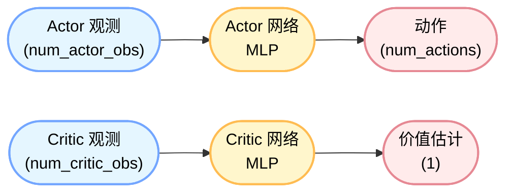
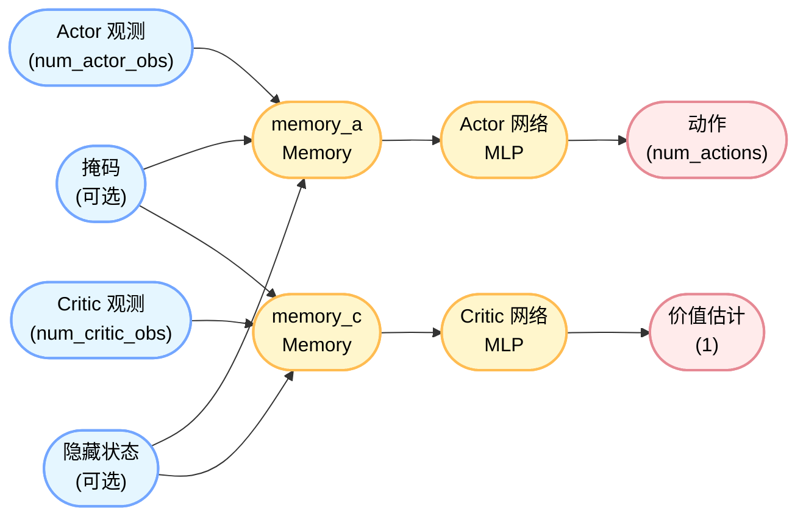

### Diagram of ActorCritic

```mermaid
graph LR
    classDef input fill:#E5F6FF,stroke:#73A6FF,stroke-width:2px,color:#000;
    classDef process fill:#FFF6CC,stroke:#FFBC52,stroke-width:2px,color:#000;
    classDef output fill:#FFEBEB,stroke:#E68994,stroke-width:2px,color:#000;

    A(["Actor 观测<br/>(num_actor_obs)"]):::input --> B(["Actor 网络<br/>MLP"]):::process
    C(["Critic 观测<br/>(num_critic_obs)"]):::input --> D(["Critic 网络<br/>MLP"]):::process

    B --> E(["动作<br/>(num_actions)"]):::output
    D --> F(["价值估计<br/>(1)"]):::output
```

### ActorCriticRecurrent

```mermaid
graph LR
    classDef input fill:#E5F6FF,stroke:#73A6FF,stroke-width:2px,color:#000;
    classDef process fill:#FFF6CC,stroke:#FFBC52,stroke-width:2px,color:#000;
    classDef output fill:#FFEBEB,stroke:#E68994,stroke-width:2px,color:#000;

    A(["Actor 观测<br/>(num_actor_obs)"]):::input --> B(["memory_a<br/>Memory"]):::process
    C(["Critic 观测<br/>(num_critic_obs)"]):::input --> D(["memory_c<br/>Memory"]):::process
    E(["掩码<br/>(可选)"]):::input --> B
    E --> D
    F(["隐藏状态<br/>(可选)"]):::input --> B
    F --> D

    B --> G(["Actor 网络<br/>MLP"]):::process
    D --> H(["Critic 网络<br/>MLP"]):::process

    G --> I(["动作<br/>(num_actions)"]):::output
    H --> J(["价值估计<br/>(1)"]):::output
```
